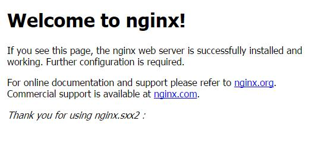

#### 1.新加一个配置 ####

    server{
     	listen 1234:
     	server_name bhz.com;
     	location / {
    		root bhz.com;
    		index index.html;
     	}
		access_log logs/bhz.com.access.log main;//会默认使用ngnix配置中的main日志格式
    } 

log基础配置
默认配置

    #log_format  main  '$remote_addr - $remote_user [$time_local] "$request" '
    #  '$status $body_bytes_sent "$http_referer" '
    #  '"$http_user_agent" "$http_x_forwarded_for"';
    
    #access_log  logs/access.log  main;
    

基础参数配置

    $remote_addr与$http_x_forwarded_for用以记录客户端的ip地址；
    $remote_user：用来记录客户端用户名称；
    $time_local： 用来记录访问时间与时区；
    $request： 用来记录请求的url与http协议；
    $status： 用来记录请求状态；成功是200，
    $body_bytes_sent ：记录发送给客户端文件主体内容大小；
    $http_referer：用来记录从那个页面链接访问过来的；
    $http_user_agent：记录客户浏览器的相关信息；
#### 2.修改host ####

    bhz.com		192.168.0.105

#### 3.访问  ###

    http://bhz.com:1235/
#### 4.修改成功 ####

